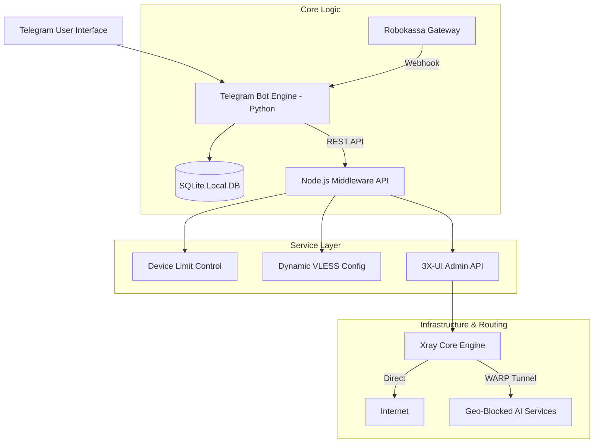

# ⚡ Locis VPN — Production-Grade Commercial VPN Platform

> **Project Status:** Archived (Sunsetting).
> **Active Period:** 2025 – 2026 (~6+ months of operation).
> **Scale & Reach:** ~500 Monthly Active Users (MAU).
> **Role:** Solo Developer / Full-Stack Engineer (Architecture, Backend, Infrastructure, iOS Routing, Telegram Bot & Monetization).

---

## 📌 Executive Summary

**Locis VPN** was a full-cycle, production-ready commercial VPN ecosystem built for privacy, performance, and cross-platform flexibility. The project provided automated subscription management, payment gateway integration, dynamic client configuration headers, hardware/fingerprint device enforcement, and custom routing for geo-blocked services (AI tools, restricted domain bypass).

The platform successfully operated for over half a year before being officially archived due to shifting regulatory conditions and strategic focus toward new engineering projects.

---

## 🏗 System Architecture & Technology Stack



### 🧰 Tech Stack

- **Languages:** Python 3.11+, JavaScript (Node.js ES6+), JSON, Shell script.
- **Protocol & Core:** Xray-core / V2Ray, VLESS + REALITY, XTLS-Vision.
- **Telegram Framework:** python-telegram-bot, aiohttp web server for webhooks.
- **Backend & Middleware:** Node.js, Express.js, SQLite3, Axios HTTPS Tunneling.
- **Panel Integration:** 3X-UI REST API via encrypted cookies.
- **Routing & Client Side:** Cloudflare WARP (WireGuard outbound), Custom iOS Routing Ruleset (uglyRaze/Locis-R).
- **Payment Processing:** Robokassa Webhook Engine (MD5 signatures & multi-tier sub extension).

---

## 🚀 Key Features & Implementation Details

### 1. Automated Telegram Commerce Bot (`bot.py`)

- **Subscription Management:** Automated trial issue (2-day trial), plan selection (1/3/12 months), and instant key delivery.
- **Robokassa Payment Processing:** Automated invoice generation and asynchronous webhook handling.
- **2-Tier Referral Engine:**
  - **Instant Referral Reward:** +7 free days granted immediately upon friend registration via unique referral link.
  - **First-Purchase Bonus:** +30 free days automatically credited to the inviter upon the friend's first payment.
- **Expiration Alerts:** Asynchronous background loop monitoring expiring subscriptions (24-hour reminder warnings).

### 2. High-Performance Middleware API (`server.js`)

- **Hardware-based Device Enforcement:** Custom tracking mechanism identifying connections by `X-Hwid` headers, IP, and User-Agent fingerprints, strictly limiting max concurrent devices (up to 7).
- **Automated Cron Cleaning:** Daily automated reset of device slots (running at 03:00 MSK) to keep connection slots accurate.
- **X-UI Direct Integration:** Programmatic client creation and subscription extension via internal API endpoints (`/panel/api/inbounds/addClient`, `/updateClient`).
- **Dynamic Subscription Endpoint (`/sub/:key`):** Delivers Base64-encoded VLESS configurations populated with rich custom client headers (`Profile-Title`, `Profile-Update-Interval`, `Support-Url`, `Announce`, `Subscription-Userinfo`).

### 3. Advanced Server Routing & Anti-Block (`xray_config.json`)

- **Smart WARP Split-Tunneling:** Routes traffic to blocked AI services (Google Gemini, OpenAI, Bard, Google AI Studio) through a WireGuard Cloudflare WARP tunnel to prevent regional access blocks.
- **Traffic Protection:** Automatic Torrent/BitTorrent protocol dropping and domain-level advertisement blocking (`geosite:category-ads-all`).

### 4. Custom Client Routing Integration (uglyRaze/Locis-R)

Native integration with custom iOS/macOS routing rule sets, ensuring that local traffic remains unproxied for high bandwidth while strictly routing blocked/restricted domains through the VPN pipeline.

---

## 📁 Repository Structure

```
.
├── bot.py                # Telegram Bot logic & Robokassa payment processing engine
├── server.js             # Node.js API middleware (Device management, X-UI sync, Sub handler)
├── xray_config.json      # Production Xray routing configuration (VLESS + WARP routing)
├── keys.db               # SQLite database schema for keys and hardware device IDs
├── bot_data.db           # SQLite database schema for Telegram subscriptions & referrals
└── README.md             # Architecture overview & project documentation
```

---

## 🛠 Deployment & Setup Instructions

### Environment Variables

Set the following environment variables before running the application:

```bash
# Telegram & Payment Config
export BOT_TOKEN="your_telegram_bot_token"
export ROBO_LOGIN="your_robokassa_login"
export ROBO_PASS1="your_robokassa_pass1"
export ROBO_PASS2="your_robokassa_pass2"
export ADMIN_ID="123456789"

# Middleware & X-UI Config
export XUI_BASE_URL="https://127.0.0.1:54321"
export XUI_BASE_PATH="/your_xui_secret_path"
export XUI_USERNAME="xui_admin"
export XUI_PASSWORD="xui_password"
export SERVER_DOMAIN="yourdomain.com"
export SERVER_IP="127.0.0.1"
```

### Installation

**Node.js Middleware:**

```bash
npm install express sqlite3 axios
node server.js
```

**Telegram Bot:**

```bash
pip install python-telegram-bot aiohttp pytz
python bot.py
```

---

## 🛡 Security & Anonymization Notice

All private IP addresses, domain names, SSL certificates, API tokens, admin IDs, and cryptographic secrets have been sanitized and replaced with environment variables/placeholders to ensure maximum security upon public archiving.

---

## 🔗 Related Repositories

- 🌐 **Locis-R** (iOS Custom Routing Rules) — Custom domain and IP ruleset for optimal iOS/macOS traffic routing.

## 📷 Applications

VPN in Happ:


Telegram-bot:


